# 環境構築手順

- [環境構築手順](#環境構築手順)
  - [概要](#概要)
    - [各セキュリティ設定の概要](#各セキュリティ設定の概要)
    - [セキュリティ参考](#セキュリティ参考)
  - [環境のデプロイ](#環境のデプロイ)
    - [環境のデプロイ手順概要](#環境のデプロイ手順概要)
    - [前提条件](#前提条件)
    - [1. Azure DevOps Servicesの構成](#1-azure-devops-servicesの構成)
    - [2. コードのインポート](#2-コードのインポート)
    - [3. サービスコネクションの構成](#3-サービスコネクションの構成)
    - [4. サービスプリンシパルの権限を所有者に変更](#4-サービスプリンシパルの権限を所有者に変更)
    - [5. パイプラインの変数グループを作成する](#5-パイプラインの変数グループを作成する)
      - [DatabricksID、テナントIDの確認方法](#databricksidテナントidの確認方法)
      - [Azure DevOpsサービス接続のプリンシパルIDの確認方法](#azure-devopsサービス接続のプリンシパルidの確認方法)
    - [6. Pipeline読み込み,実行](#6-pipeline読み込み実行)
  - [Azure Synapse Analytics設定](#azure-synapse-analytics設定)
    - [Azure Synapse Analytics設定手順概要](#azure-synapse-analytics設定手順概要)
    - [1. IPアドレスの追加](#1-ipアドレスの追加)
    - [2. AD管理者の設定](#2-ad管理者の設定)
    - [3. 権限付与設定](#3-権限付与設定)
  - [Azure Databricks設定](#azure-databricks設定)
    - [Azure Databricksの設定手順概要](#azure-databricksの設定手順概要)
    - [1. dboファイルのダウンロード](#1-dboファイルのダウンロード)
    - [2. dboファイルのインポート](#2-dboファイルのインポート)
    - [3. PAT(Private Access Token)の作成](#3-patprivate-access-tokenの作成)
    - [4. Scope作成](#4-scope作成)
      - [Azure Key VaultのDNS名、リソースIDの確認方法](#azure-key-vaultのdns名リソースidの確認方法)
    - [5. KeyvaultSecretの登録](#5-keyvaultsecretの登録)
    - [(Oprion) クラスターの構成](#oprion-クラスターの構成)
  - [疎通確認](#疎通確認)
  - [次のステップ](#次のステップ)

---

## 概要

Azure分析基盤を迅速に構築します。  
このテンプレートでは、Vnetの利用を前提にしており、一般的なセキュリティベースラインをパスすることを想定しています。

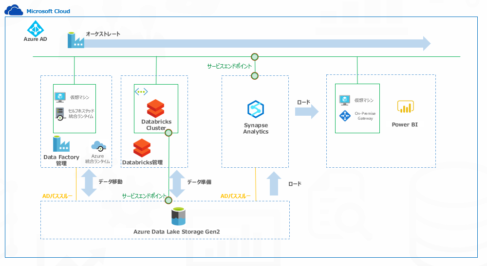

### 各セキュリティ設定の概要

手順を実施すると以下のような設定のリソース群がデプロイされます。（※NICなどの付随リソースは省略）

|リソース種類 |リソース命名規則  |設定内容（既定で設定されるものは含めておりません）  |備考  |
|---------|---------|---------|---------|
|Azure Data Factory     | (BASE_NAME)-adf        | Synapse Analytics との Linked Service        |MSI認証により、Self-hosted IRでの接続 <br> 接続先はKey Vaultから取得        |　 |     |         | Key Vault との Linked Service        | MSI認証により、Azure IRでの接続        |
|     |         | Databrikcs との Linked Service        | Private Access TokenをKeyVaultより取得して認証        |
|     |         | Data Lake Storage Gen2 との Linked Service        | MSI認証（信頼されたサービス接続）により、Azure IRでの接続         |
|     |         | 外部ストレージアカウント(contosoretaildw) との Linked Service        | SAS認証 <br> データの取得元         |
| Virtual Network    | (BASE_NAME)-vnet         |  仮想ネットワーク       | サブネット：gateway、adb-public-subnet 、adb-private-subnetを保持       |
|Network Security Group     | (BASE_NAME)-gateway-nsg        | gatewayサブネット（Power BI Onpremise Data Gateway , Selfhosted IR用）にインバウンドを制限する。 <br> 指定したIPのRDP接続のみを許可          |        |
|Network Security Group     | (BASE_NAME)-adb-nsg        | 既定設定のみ         | Databricks委任        |
|Azure SQL Server     | (BASE_NAME)-sql        | ManagedIDの生成        |         |
|     |         | Advanced Data Security設定        |　参考：[Advanced Data Security](https://docs.microsoft.com/ja-jp/azure/azure-sql/database/advanced-data-security) <br>[Azure SQL Database、SQL Managed Instance、Azure Synapse Analytics のための Advanced Threat Protection](https://docs.microsoft.com/ja-jp/azure/azure-sql/database/threat-detection-overview)         |
|     |         | gateway サブネット、databricks用サブネットとのサービスエンドポイント接続        |         |
|     |         | 指定したIPのみを許可        |         |
|     |         | Azure サービスおよびリソースにこのサーバーへのアクセスを許可する：いいえ       |         |
| Azure Synapse Analytics     | (BASE_NAME)-dw      | DWU=500        |         |
|     |         | 透過的な保存データ暗号化        | 参考:[SQL Database、SQL Managed Instance および Azure Synapse Analytics の透過的なデータ暗号化](https://docs.microsoft.com/ja-jp/azure/azure-sql/database/transparent-data-encryption-tde-overview?tabs=azure-portal)        |
|     |         | ストレージへのデータベースレベル監査ログ出力        | 参考：[Azure SQL Database および Azure Synapse Analytics の監査](https://docs.microsoft.com/ja-jp/azure/azure-sql/database/auditing-overview)        |
|     |         | ELT処理用のワークロードグループ        |         |
|Azure Data Lake Storage Gen2     | (BASE_NAME)-adls        | 名称：datalakeのコンテナ        |         |
|     |         | 選択されたネットワークのみを許可        |         |
|     |         | 指定したIPとの接続を許可        |         |
|     |         | DataFactoryに対して、Blobデータ共同作成者権限ロール付与        |         |
|     |         | SQL Serverに対して、Blobデータ共同作成者権限ロール付与        |         |
|Azure Databricks     | (BASE_NAME)-adb        | Vnetへのデプロイ        |         |
|Azure KeyVault     | (BASE_NAME)-akv        | DataFactoryへのアクセスポリシーの付与        |         |
|||Azure Databricksへのアクセスポリシーの付与|
|||Azure DevOpsのサービス接続用サービスプリンシパルへのアクセスポリシーの付与|
|||シークレット：datalakeKey <br> Azure Data Lake Storage Gen2のアカウントアクセスキー|
|||シークレット：DataLakeAccountName <br> Azure Data Lake Storage Gen2のアカウント名|
|||シークレット：ELTLoaderLoginId <br> ELT用ユーザのログインID|
||| シークレット：ELTLoaderLoginPassword <br> ELT用ユーザのログインパスワード|
|||シークレット：sqlConnectionString <br> SQLSever接続文字列|
|||シークレット：ARMStorageSaSToken <br> ARM展開用のストレージSASトークン|
|||シークレット：SQLServerName <br> SQLSever名称|
|||シークレット：SQLDWName <br> Synapse Analytics名称|
|Virtual Machine     |  (BASE_NAME)-pbgw-vm       | Standard_A4_v2        | Power BI Onpremise Data Gateway用VMのSKU        |
|Virtual Machine     | vm0-(BASE_NAME先頭3文字)       |Standard_A4_v2 |Self-hosted IR用VMのSK|
|||Data Factory用Self hosted IRインストール        | [Create self host IR and make it workable in azure VMs](https://github.com/Azure/azure-quickstart-templates/tree/master/101-vms-with-selfhost-integration-runtime)を利用        |
|Storage Account |(BASE_NAME)armsa|既定設定のみ|Data Factory用のARMテンプレート展開先の一時配置場所|

### セキュリティ参考 

このハンズオンで利用される、ARMテンプレートはセキュリティ要件のうち、特に注視されるデータのセキュリティを中心に設定しています。  
**以下の参考を全て網羅的に達成しているものではありません。各自の責任のもと利用してください。**

 - [BLOB ストレージのセキュリティに関する推奨事項](https://docs.microsoft.com/ja-jp/azure/storage/blobs/security-recommendations?toc=%2Fazure%2Fsecurity%2Ftoc.json&bc=%2Fazure%2Fsecurity%2Fbreadcrumb%2Ftoc.json)
 - [Azure SQL Database と Azure SQL Managed Instance で一般的なセキュリティ要件を解決するためのプレイブック](https://docs.microsoft.com/ja-jp/azure/azure-sql/database/security-best-practice)
 - [Azure Databricks Best Practices](https://github.com/Azure/AzureDatabricksBestPractices/blob/master/toc.md#do-not-store-any-production-data-in-default-dbfs-folders)

## 環境のデプロイ

AzureリソースのデプロイにはARMテンプレートを利用します。  
DevOpsパイプラインを構成し、環境構築パイプラインを設定・実行します。

### 環境のデプロイ手順概要

1. Azure DevOps Servicesの構成
2. コードのインポート
3. サービスコネクションの構成
4. サービスプリンシパルの権限を所有者に変更
5. パイプラインの変数グループを作成する
6. Pipeline読み込み,実行

### 前提条件

- 作業者はサブスクリプション所有者である必要があります。
- [SSMS 18.x以降](https://docs.microsoft.com/ja-jp/sql/ssms/download-sql-server-management-studio-ssms?view=sql-server-ver15)などのSQL クライアントツールをインストールしてください。

---

### 1. Azure DevOps Servicesの構成

Azure DevOpsを利用していくつかのパイプラインを実行します。  
Azure DevOps 組織をまだ持っていない場合は、[「クイック スタート: 組織またはプロジェクト コレクションを作成する」](https://docs.microsoft.com/en-us/azure/devops/organizations/accounts/create-organization?view=azure-devops)の手順に従って作成します。

組織を構成したあとは、[「Azure DevOps および TFS でのプロジェクトの作成」](https://docs.microsoft.com/en-us/azure/devops/organizations/projects/create-project?view=azure-devops)のガイドを使用して新しいプロジェクトを作成します。

### 2. コードのインポート

作成したDevOpsにサインインして、リポジトリのインポート画面に移動します。
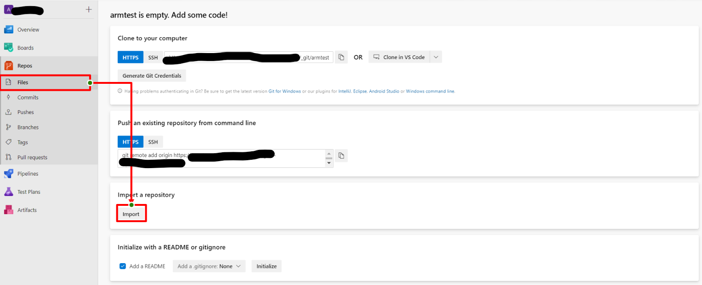

インポートのための設定をして、「Import」を選択します。  
正常終了するとコードがインポートされます。

| 項目 | 設定値 | 備考 |
|--|--|--|
| Repository type | Git |  |
| Clone URL |このRepositoryのURL  |  |
| Requires Authentication | チェックしません |  |

---

### 3. サービスコネクションの構成

Azure DevOpsのサービスコネクション作成画面に移動します。


デプロイ対象のリソースグループ、サブスクリプションを指定し、名称を「**azure-resource-connection**」に設定し、「save」を選択します。


---

### 4. サービスプリンシパルの権限を所有者に変更

[Azure Portal](https://portal.azure.com)に移動して、リソースグループの共同作成者にDevOpsプロジェクトの名称ではじまるサービスプリンシパルが登録されていることを確認します。

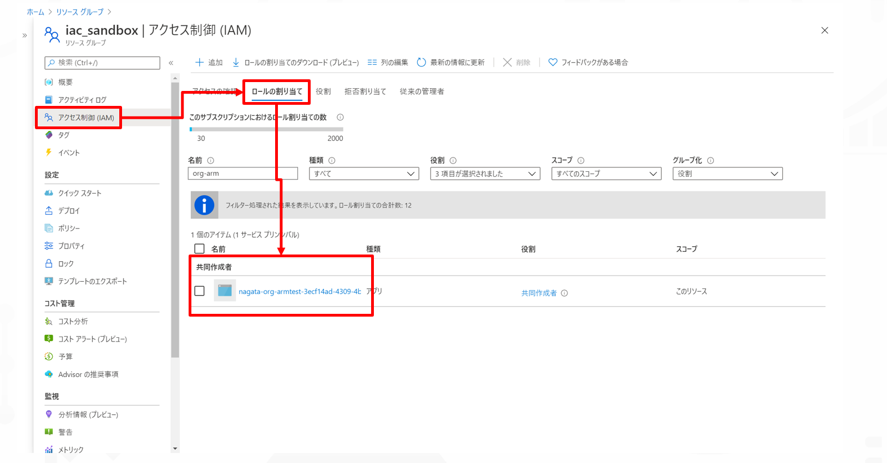

[追加]ボタンから、対象のサービスプリンシパルを所有者に登録します。


---

### 5. パイプラインの変数グループを作成する

「ライブラリ」タブから変数グループの作成をします。

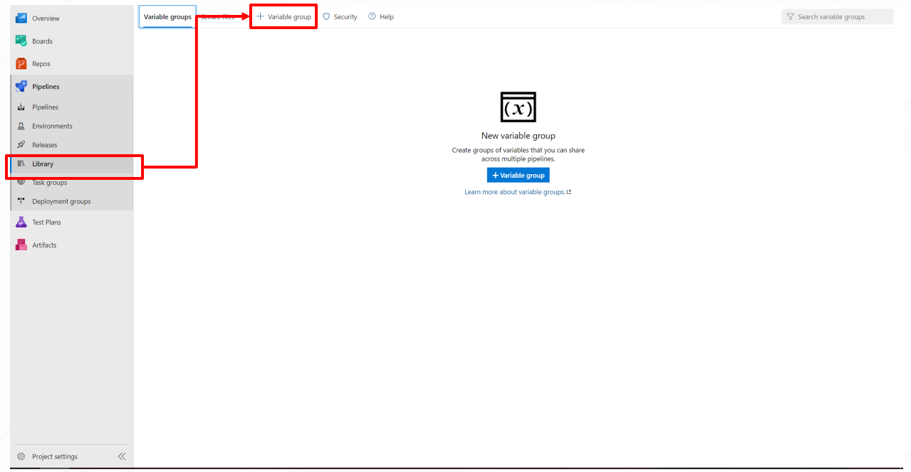

名称を **「devops-iac-vg」** としたうえで変数内容を設定し、「save」をクリックします。

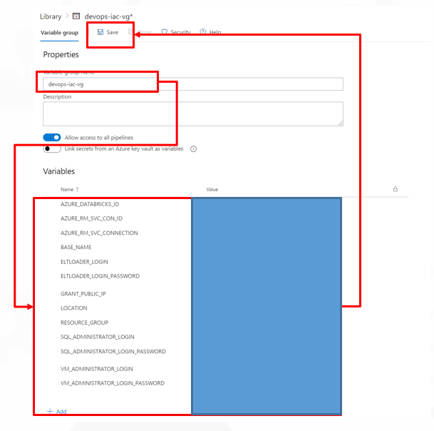

| 変数名                              | 設定値                       | 備考                                       |
|----------------------------------|---------------------------|------------------------------------------|
| SQL_ADMINISTRATOR_LOGIN          | 任意                        | SQL Serverの管理者ID                          |
| SQL_ADMINISTRATOR_LOGIN_PASSWORD | 任意                        | SQL Serverの管理者パスワード 8文字以上                  |
| AZURE_DATABRICKS_ID              | (要確認)                     | Databricksのテナント内プリンシパルID。確認方法は後述         |
| AZURE_RM_SVC_CON_ID              | (要確認)                     | Azure DevOpsサービス接続のプリンシパルID。確認方法は後述      |
| AZURE_RM_SVC_CONNECTION          | azure-resource-connection | 変更不可                                     |
| BASE_NAME                        | 例：dev-viz                 | 小文字英字およびハイフン7文字以内。各リソースの接頭辞となります。 一意となる必要があります。 |
| GRANT_PUBLIC_IP | 任意 xxx.xxx.xxx.xxx | 各ファイアウォールで許可するPublic IP。範囲指定不可のため、複数を許可したい場合は、デプロイ後に追加が必要です。
| ELTLOADER_LOGIN                        | ETLLoader                 | ETL User <br> 後続で利用するため固定 |
| ELTLOADER_LOGIN_PASSWORD                        | 任意                 | ETL Userのパスワード 8文字以上|
| LOCATION                         | 任意                 |　リソースのデプロイ先リージョン。japaneastなどを指定                                   |
| RESOURCE_GROUP                   | 任意                        | デプロイ対象のリソースグループ名                         |
| VM_ADMINISTRATOR_LOGIN           | 任意                        | Azure VMのの管理者ID                          |
| VM_ADMINISTRATOR_LOGIN_PASSWORD  | 任意                        | Azure VMの管理者パスワード <br> 英数字大小含む12文字以上          |

---

#### DatabricksID、テナントIDの確認方法

[Azure Portal](https://portal.azure.com)に移動して、ActiveDirectoryを検索します。


「エンタープライズアプリケーション」タブに移動して、アプリケーションの種類を **「全てのアプリケーション」** に変更したうえで「AzureDatabricks」を選択すると、オブジェクトIDが表示されます。


#### Azure DevOpsサービス接続のプリンシパルIDの確認方法

リソースグループのアクセス制御(RBAC)画面から、サービスプリンシパルをクリックし、概要画面で確認可能です。

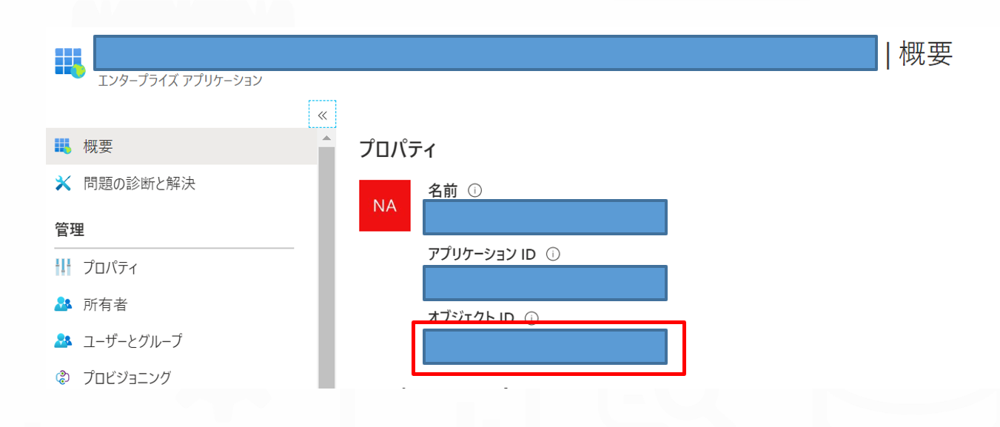

---

### 6. Pipeline読み込み,実行

DevOpsに戻り、Pipelineの作成を行います。

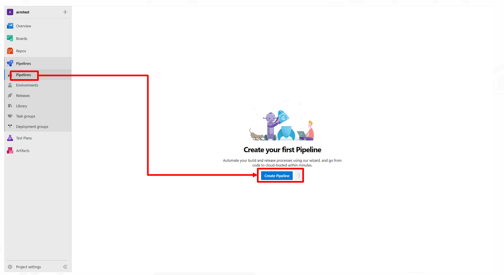

「Azure Repos Git」→ 「<repository名>」の順に選択します。


「Existing Azure Pipelines YAML file」→「/00_Environment/iac-create-environment-pipeline-arm.yml」の順に選択します。
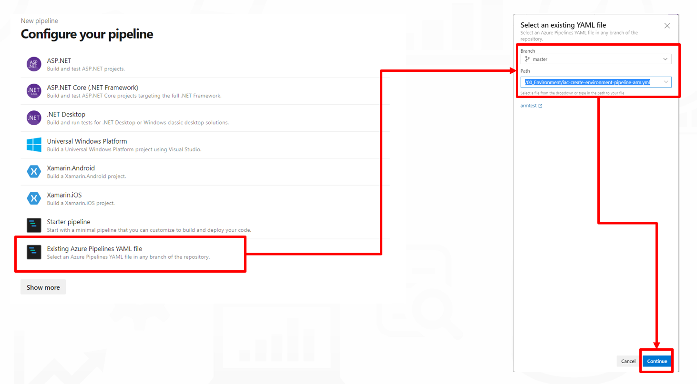

YAMLファイルの内容が表示されるので、「RUN」をクリックします。

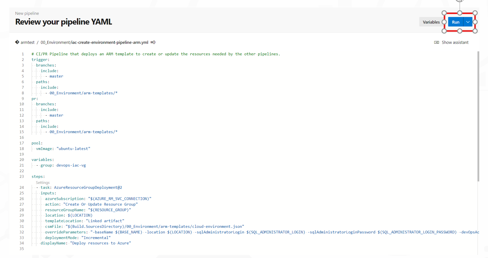

---

## Azure Synapse Analytics設定

Azure Synapse Analyitcs とそれをホストするSQL Serverの設定を行います。

### Azure Synapse Analytics設定手順概要

1. IPアドレスの追加
2. ad管理者の設定
3. adfリソース追加

---

### 1. IPアドレスの追加

[Azure Portal](https://portal.azure.com)上の、SQL Serverのリソースに移動します。


「ファイアウォール設定の表示」をクリックします。


クライアントIPのリストに必要なIPアドレスが記載されていることを確認して、不足していれば追加の上、保存します。

>**補足**  
IPアドレスの設定はSQL ServerのリソースをARMテンプレートとしてエクスポートして、該当箇所をcloud-environment.jsonに反映することで、同様の設定が再現できます。

---

### 2. AD管理者の設定

「Active Directory管理者」→「管理者の設定」に移動して、ユーザorグループを選択します。


保存をクリックします。

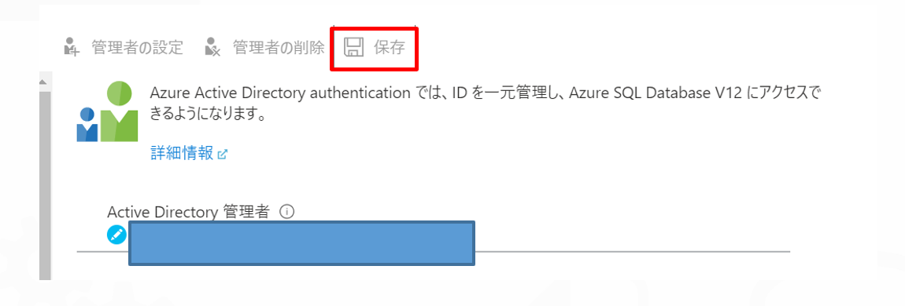

---

### 3. 権限付与設定

SSMSでAD認証を利用してSQL Serverにログインします。

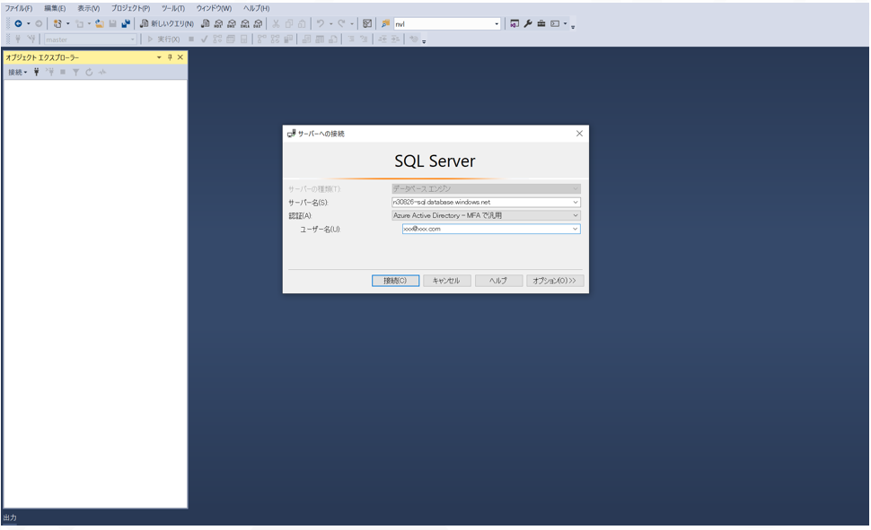

以下のスクリプトを実行します。**※パスワードは変数グループで作成した値を利用します。**

```sql
-- sql
CREATE LOGIN ETLLoader WITH PASSWORD = 'xxxxxxx';
CREATE USER ETLLoader FOR LOGIN ETLLoader;
```

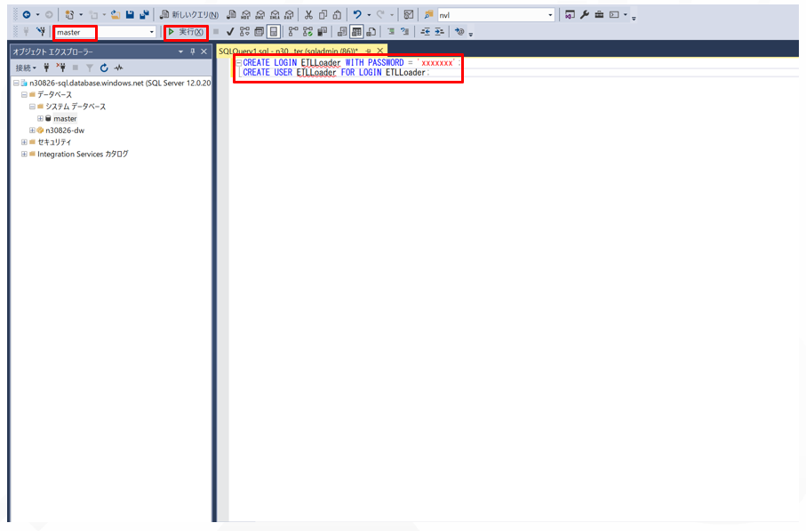

次に、データベースをSQL Poolに変更し、以下のスクリプトを実行します。
**※リソース名は適宜変更してください。**

```sql
-- sql
--Data Factoryに対して、権限付与
CREATE USER [DataFactoryのリソース名] FROM EXTERNAL PROVIDER;
EXEC sp_addrolemember 'db_owner', 'DataFactoryのリソース名'

--ETL用ユーザーに対して、権限付与
CREATE USER ETLLoader FOR LOGIN ;
EXEC sp_addrolemember 'db_owner', 'ETLLoader'

--上記二点のユーザをELT処理用のワークロード管理グループに分類されるように構成
CREATE WORKLOAD CLASSIFIER [ELT_ADF]
WITH (WORKLOAD_GROUP = 'ELT'
      ,MEMBERNAME = 'DataFactoryのリソース名'
      ,IMPORTANCE = NORMAL);

CREATE WORKLOAD CLASSIFIER [ELT_Loader]
WITH (WORKLOAD_GROUP = 'ELT'
      ,MEMBERNAME = 'ETLLoader'
      ,IMPORTANCE = NORMAL);


```

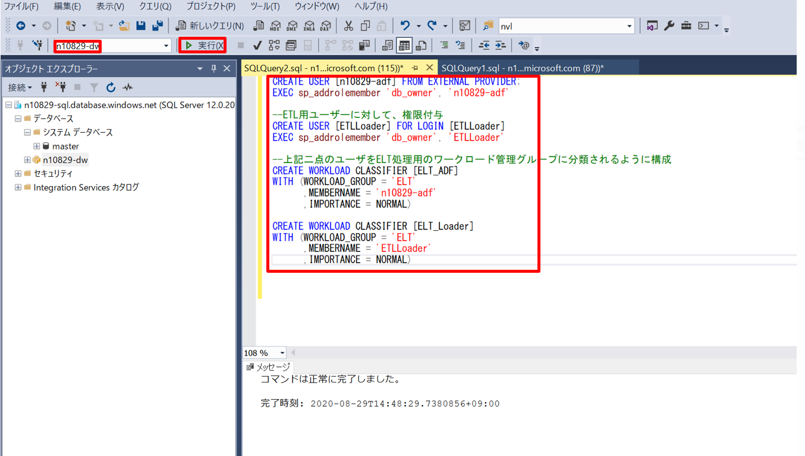

---

## Azure Databricks設定

### Azure Databricksの設定手順概要

1. dboファイルのダウンロード
1. dboファイルのインポート
1. PAT(Private Access Token)の作成
1. Scope作成
1. KeyvaultSecretの登録

---

### 1. dboファイルのダウンロード

DevOpsから対象の「SparkETL.dbc」をダウンロードします。

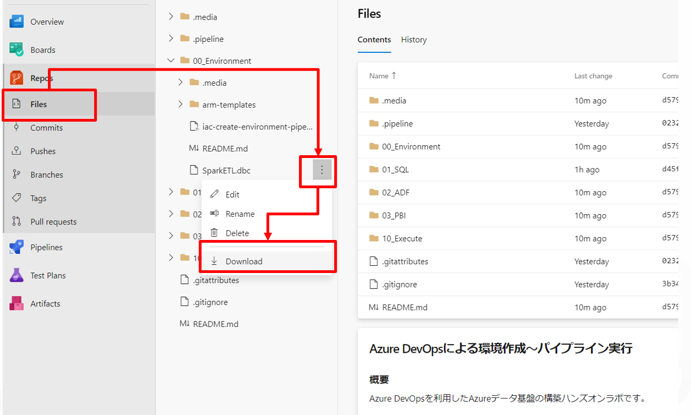

---

### 2. dboファイルのインポート

Databricksに移動します。

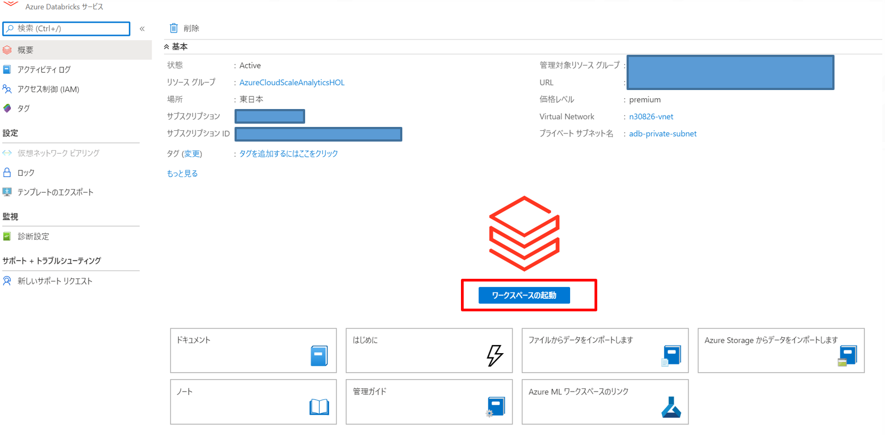

Shared フォルダにimportします。

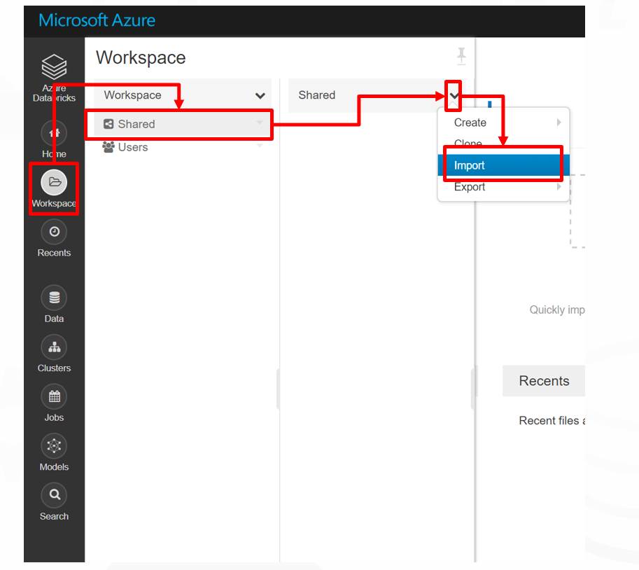

---

### 3. PAT(Private Access Token)の作成

PATを利用して、他のシステムに権限を委任して各種の操作が可能になります。
※PATの権限は発行者に基づきます。

Databricksのリソースに移動して、「Workspaceの起動」から、ワークスペースにログインします。  
ログイン後、以下の図のように画面を選択し、「Generate New Token」をクリックします。


コメントと利用期限を設定し、「Generate」をクリックします。  
表示されたPATは後の手順で利用するのでメモしてください。

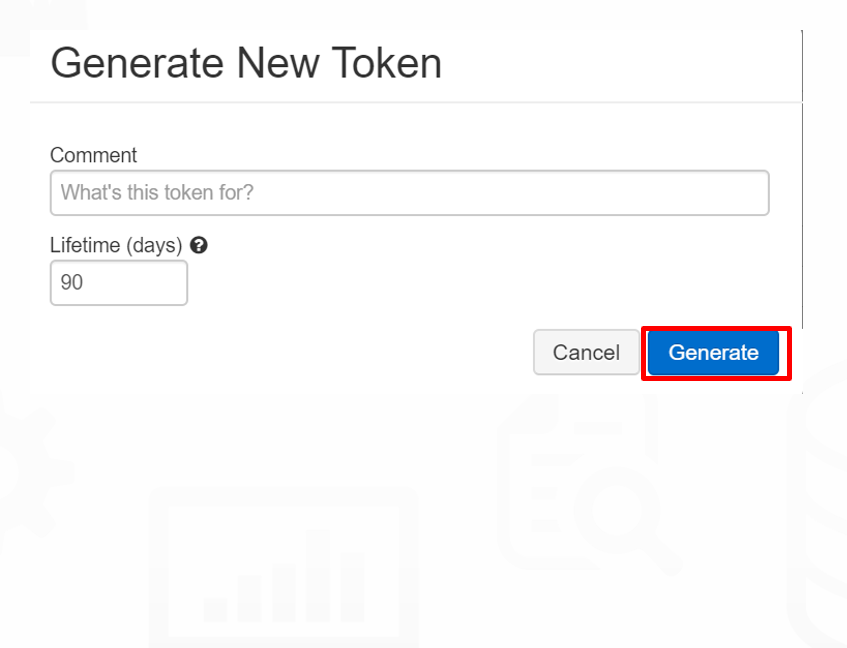

---

### 4. Scope作成

DatabricksのURLに「#secrets/createScope」を追加して移動します。

例：


以下のように設定して、「Create」をクリックします。

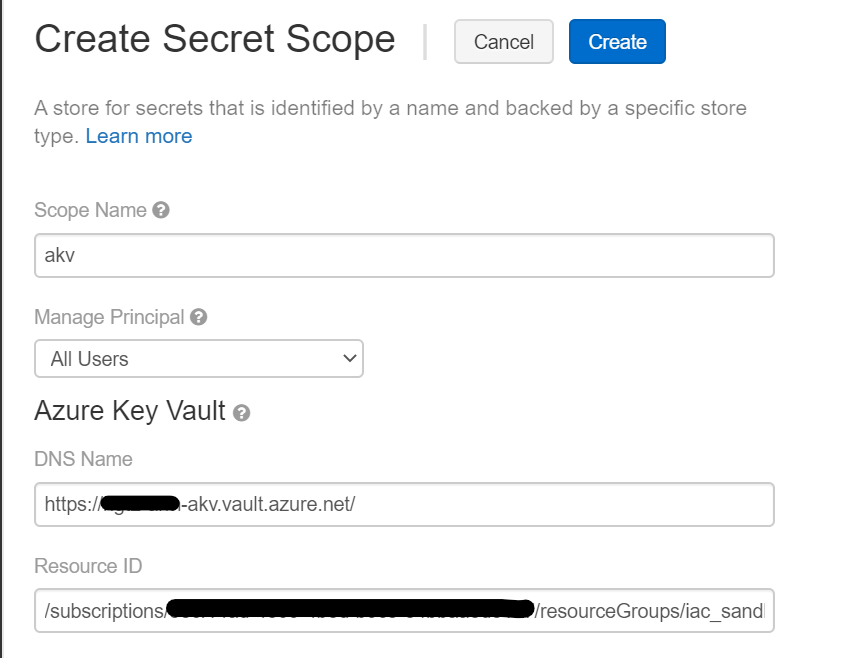)

|項目  |設定値  |備考  |
|---------|---------|---------|
|Scope Name     | akv        | Notebookで利用するものとあわせてください        |
|Manage Principal     | All Users        | 適宜変更可能        |
|DNS Name     |         | Azure Key VaultのDNS名。確認方法は後述        |
|Resouce ID     |         | Azure Key VaultのリソースID。確認方法は後述        |

#### Azure Key VaultのDNS名、リソースIDの確認方法

Key Vaultのリソースに移動し、プロパティをクリックすることで確認可能です。


> 注意  
> 本テンプレートではKey Vaultは**2つ作成されます（Azure ML用、その他用）**
AZure ML専用のリソースには ***-aml-kv*** と付与されているため、その他用である末尾が ***-akv*** となっているリソースを選択してください。

---

### 5. KeyvaultSecretの登録

Key Vaultのリソースで、アクセスポリシーを追加します。
「アクセスポリシー」→「アクセスポリシーの追加」に移動し、「キー、シークレット、および証明書の管理」を選択の上、「プリンシパルの選択」で自身を選択して、「追加」をクリックします。

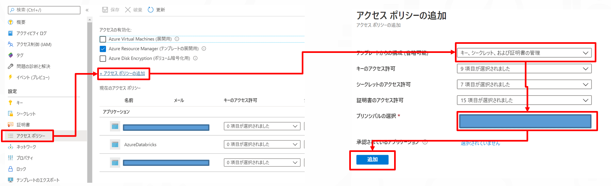

追加後、保存します。


次に、シークレットの作成画面に移動して、「生成/インポート」をクリックします。


内容を設定して、作成します。

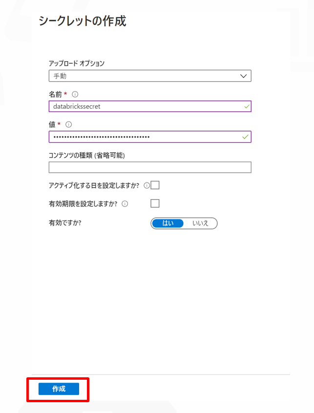

|項目 |設定値  |備考  |
|---------|---------|---------|
|アップロードオプション    | 手動        | 既定設定        |
|名前     | databrickssecret        | DataFactoryで利用されているため、変更不可        |
|値     | <PATを貼り付け>        |         |
|コンテンツの種類    | 任意の値        |         |
|アクティブ化する日を設定しますか？     | チェックしない        | 既定        |
|有効期限を設定しますか？     | チェックしない        | 既定       |
|有効ですか？     | はい        | 既定        |

### (Oprion) クラスターの構成

アドホック分析用にクラスターを構成可能です。  
**※VMのクォータ制限に注意してください**

クラスターの作成画面に移動します。
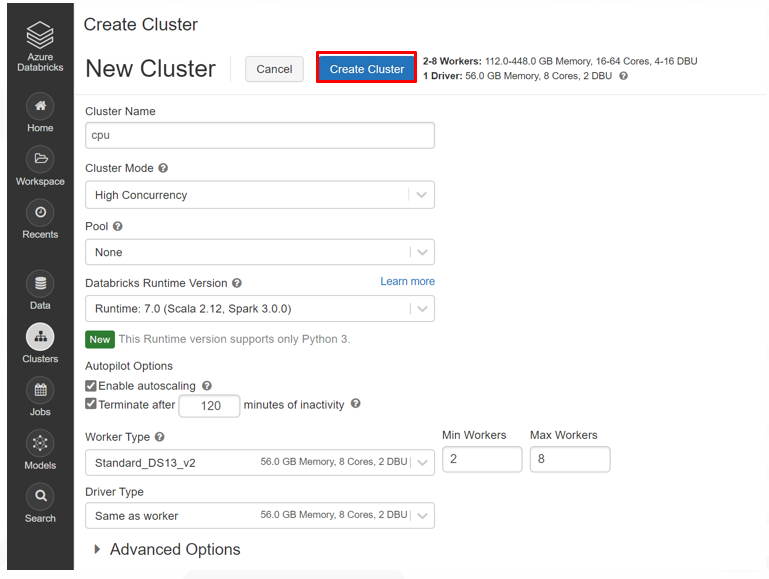

名前などを設定し、「Create Cluster」をクリックします。

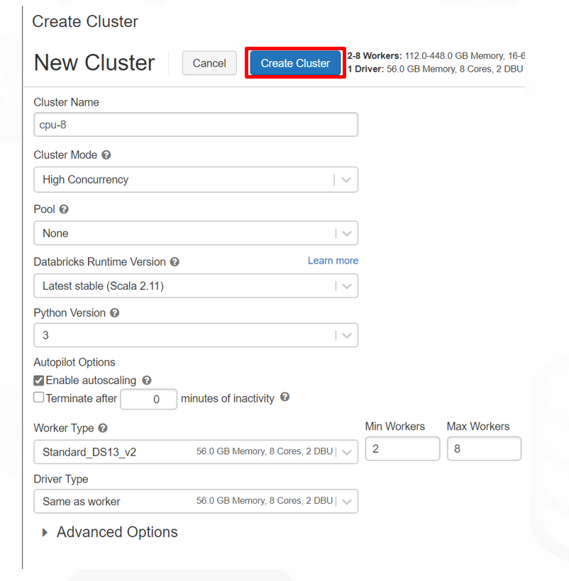

|項目  |設定値  |備考  |
|---------|---------|---------|
|Cluster Name    | 任意        |         |
|Cluster Mode     | High Concurrency        |         |
|Pool     | None        | 既定        |
|Databricks Runtime Version     | Runtime 7.x        | 既定        |
|Python Version     | 3        | 既定        |
|Enable autoscaling     | チェック        | 既定        |
|Termininate after minutes of inactivity    | チェックします       | チェックを入れることで120分に設定        |
|Worker Type     | 任意        | 既定でOK        |
|Driver Type     | Same as worker       | 既定でOK       |

---

## 疎通確認

この時点で、Data Factoryの作成画面から、Linked Service、およびSelf-hosted IRの接続が正常であることが確認できます。

## 次のステップ

[データベースプロジェクトのデプロイ](../01_SQL/README.md)  
