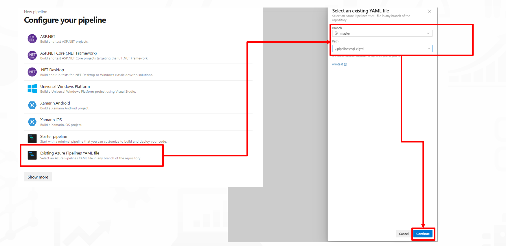
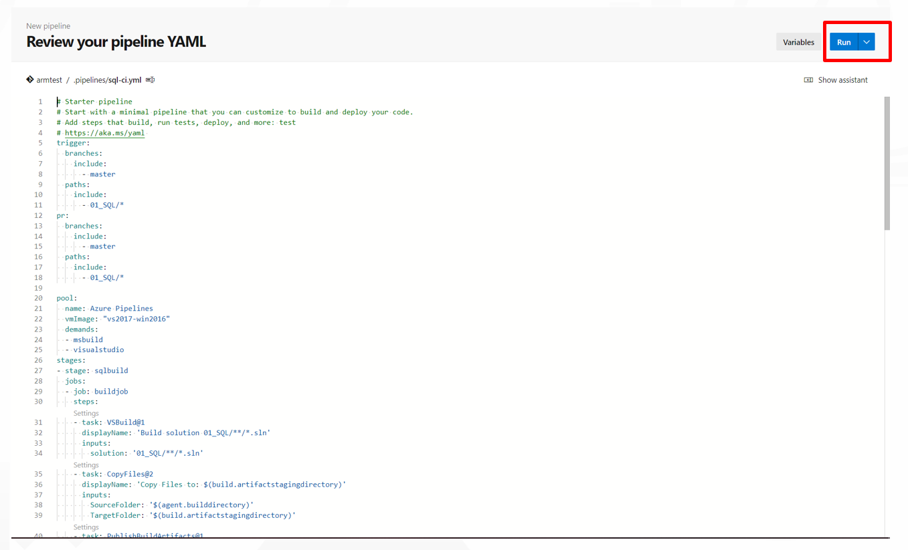

# データベースプロジェクトのデプロイ

- [データベースプロジェクトのデプロイ](#データベースプロジェクトのデプロイ)
  - [概要](#概要)
  - [DBデプロイパイプラインの構成](#dbデプロイパイプラインの構成)
    - [DBデプロイパイプラインの構成手順概要](#dbデプロイパイプラインの構成手順概要)
    - [1. Pipelineの読み込み、実行](#1-pipelineの読み込み実行)
  - [次のステップ](#次のステップ)

## 概要

Visual Studio Datatoolで事前作成されたDBプロジェクトをAzure DevOps Pipelineによりデプロイします。

>**注意**  
ソリューションファイルはVisual Studio 2019以降のバージョンでご利用いただけます。

## DBデプロイパイプラインの構成

DevOpsパイプラインの設定を行います。

### DBデプロイパイプラインの構成手順概要

1. Pipelineの読み込み、実行

---

### 1. Pipelineの読み込み、実行

DevOps画面からPipelineの作成を行います。

「Azure Repos Git」→ 「<repository名>」の順に選択します。

「Existing Azure Pipelines YAML file」→「.pipelines/sql-ci.yaml」の順に選択します。

YAMLファイルの内容が表示されるので、「RUN」をクリックします。

実行完了後、テーブルなどのオブジェクトが確認可能となります。

## 次のステップ

[Azure Data Factory 成果物のデプロイ](../02_ADF/README.md)  
