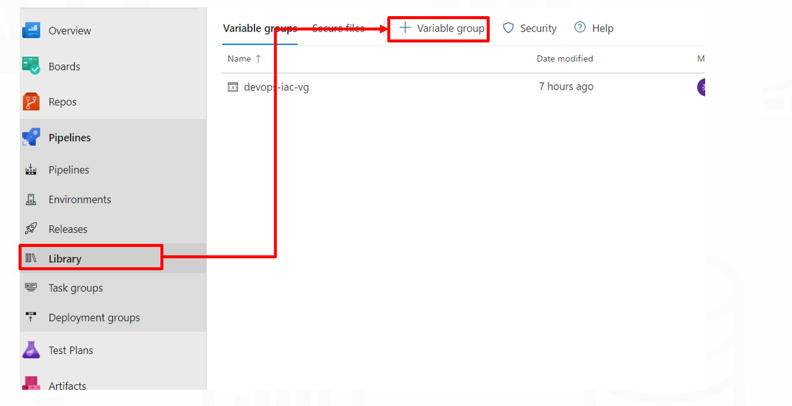
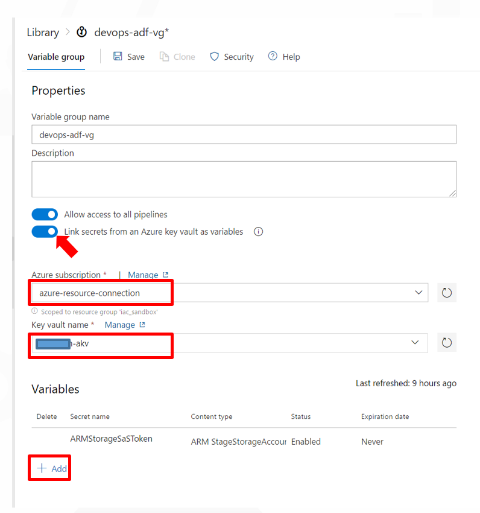
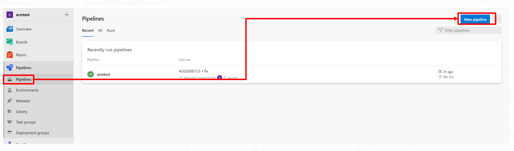
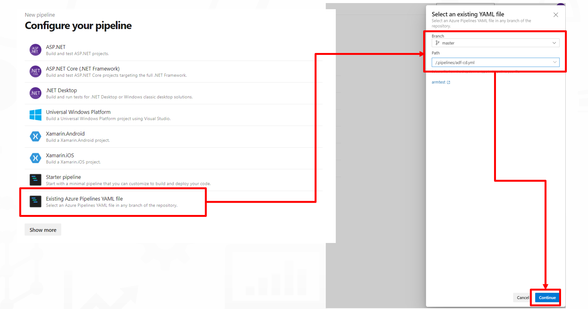
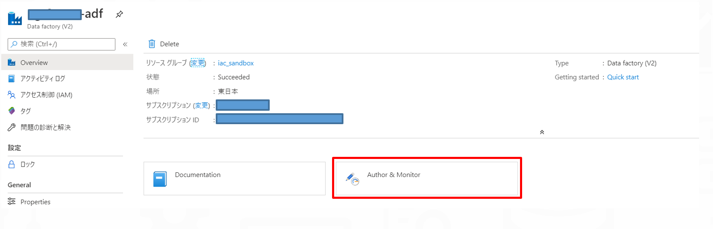
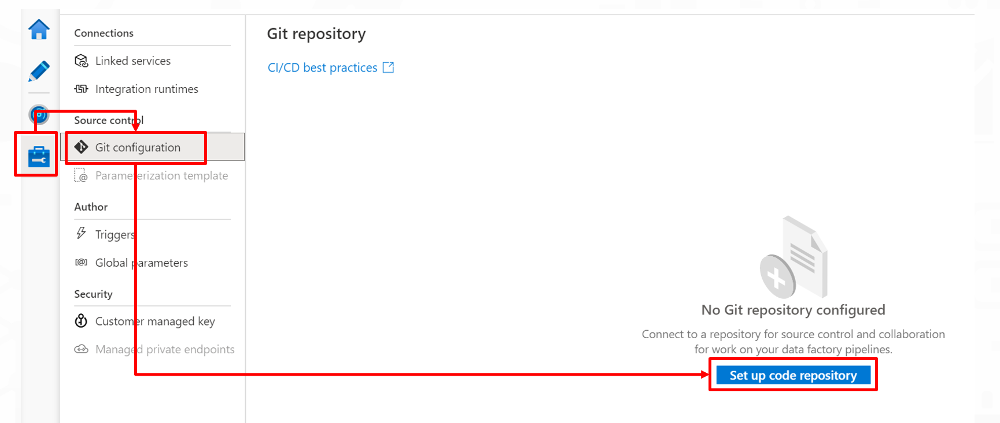
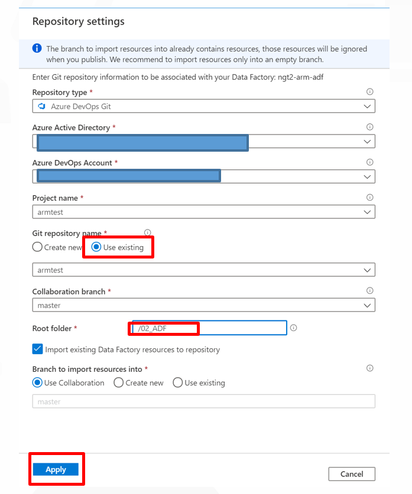

# Azure Data Factory 成果物のデプロイ

- [Azure Data Factory 成果物のデプロイ](#azure-data-factory-成果物のデプロイ)
  - [概要](#概要)
  - [ADFデプロイパイプラインの構成](#adfデプロイパイプラインの構成)
    - [手順概要](#手順概要)
    - [1. 変数グループの作成](#1-変数グループの作成)
    - [2. パイプラインの読み込み、実行](#2-パイプラインの読み込み実行)
    - [3. Azure Repos連携の設定](#3-azure-repos連携の設定)
  - [次のステップ](#次のステップ)

## 概要

Data Factory の成果物(Pipline,Datasetなど)をデプロイします。

## ADFデプロイパイプラインの構成

DevOpsパイプラインの設定を行います。

### 手順概要

1. 変数グループの作成
2. パイプラインの読み込み、実行
3. Azure Repos連携の設定

---

### 1. 変数グループの作成

「ライブラリ」タブから変数グループの作成をします。

名称を **「devops-adf-vg」** としたうえで、「Link secrets from an Azure key vault as variables」をオンに変更し、設定を行います。  

| 項目 | 設定値 | 備考 |
|-----|------|------|
| Azure subsctiption | azure-resouce-connection | リストから選択します。 |
| Key vault name | 作成したKeyVault(Azure ML用ではないもの) |リストから選択します。 |

Variablesの設定は「+Add」ボタンから「**ARMStorageSaSToken**」を選択します。  
設定が完了したら「Save」をクリックします。

---

### 2. パイプラインの読み込み、実行

DevOps画面からPipelineの作成を行います。

「Azure Repos Git」→ 「<repository名>」の順に選択します。

「Existing Azure Pipelines YAML file」→「.pipelines/adf-cd.yaml」の順に選択します。

YAMLファイルの内容が表示されるので、「RUN」をクリックします。

---

### 3. Azure Repos連携の設定

実行完了後、Azure PortalからData Factoryのリソースに移動して、「Author & Monitor」をクリックします。

>補足:  
この時点で、Data Factoryのリソースが反映されていることが確認できます。

Manageハブに移動して、「Git Configuration」→「Set up code repository」をクリックします。

以下のように設定して、「Apply」をクリックします。
クリックにより、Azure DevOpsと連携され、Data Factoryの開発内容がAzure DevOps上でGit管理されます。

|項目  |設定値  |備考  |
|---------|---------|---------|
|Repository type     | Azure DevOps Git        |         |
|Azure Active Direcotry     | 任意        |         |
|Azure DevOps Account     | 任意        | 手順内で作成したものを選択します。        |
|Project Name     | 任意        | 手順内で作成したものを選択します。        |
|Git repository name     | Use exsisting       |         |
|同上     | 任意        | 手順内で作成したものを選択します。        |
|Collaboration branch     | master        | 既定        |
|Root folder     | 02_ADF        |         |
|Import exsisting Data Factory resources to repository     | チェック        | 既定       |
|Branch to import resoureces into     | Use Collaboration        | 既定        |

## 次のステップ

[Power BIの接続確認](../03_PBI/README.md)
