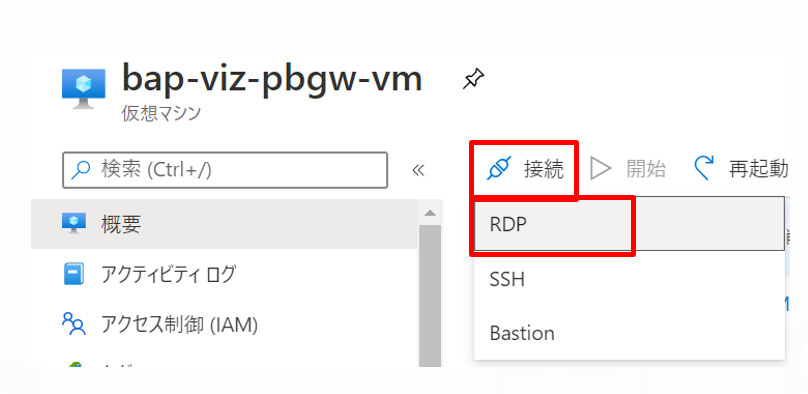
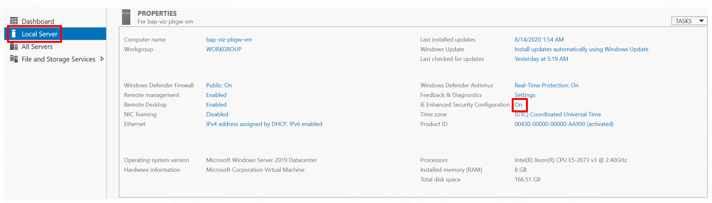
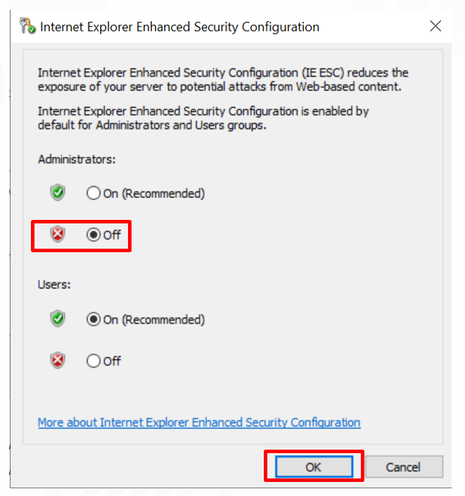
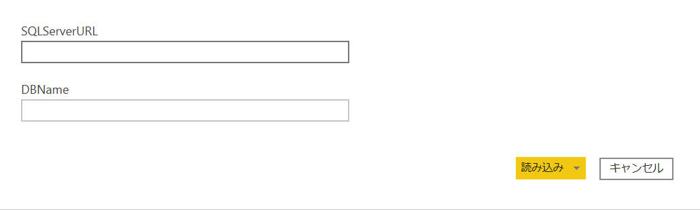
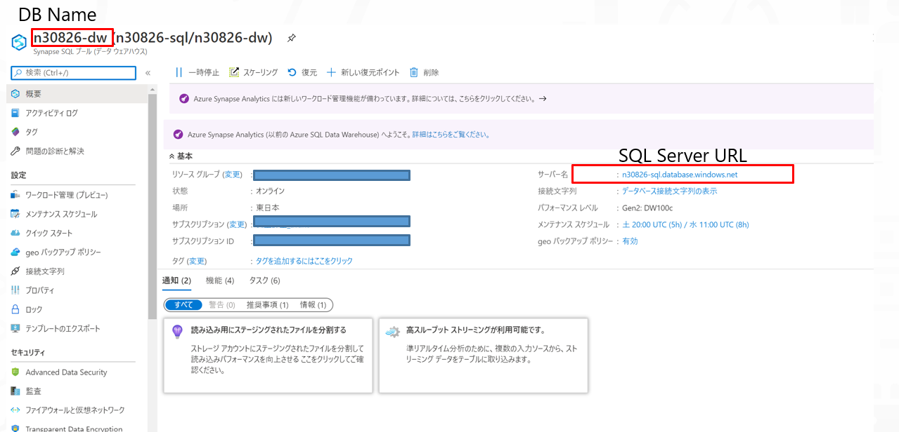
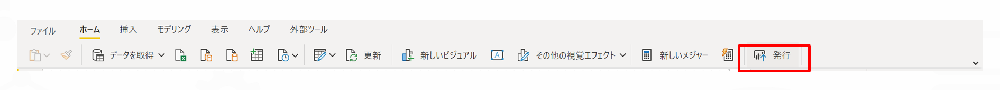
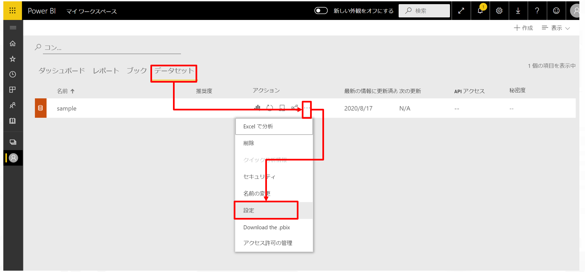
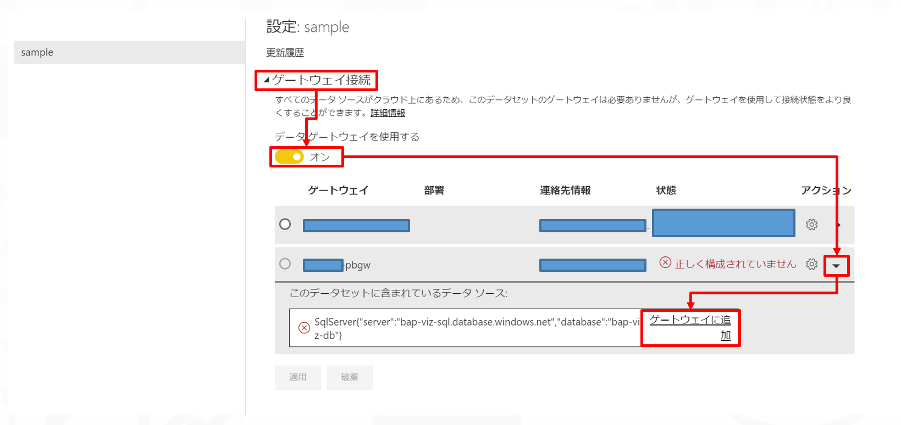
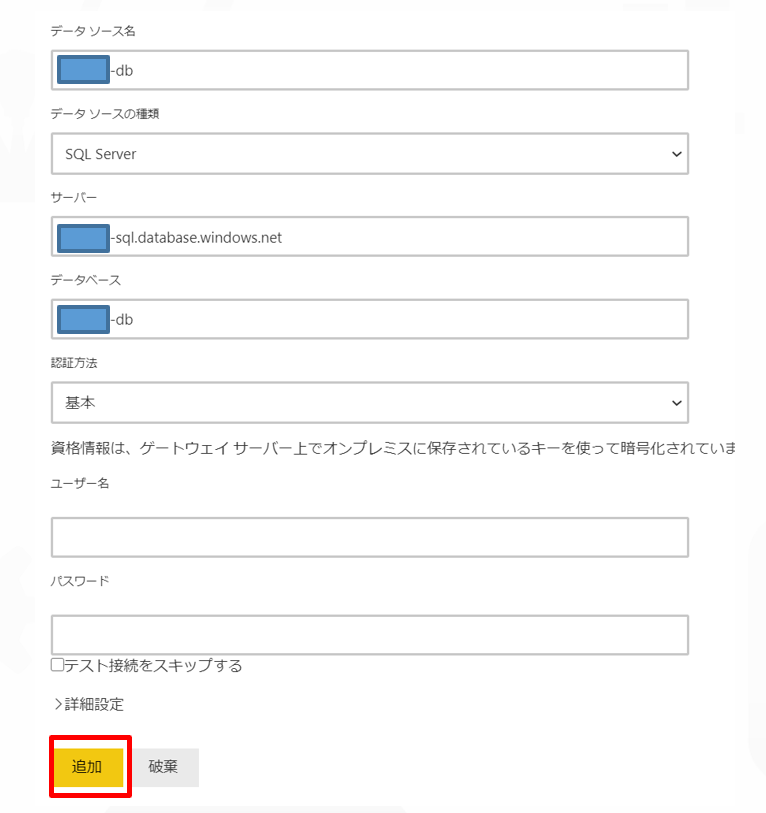
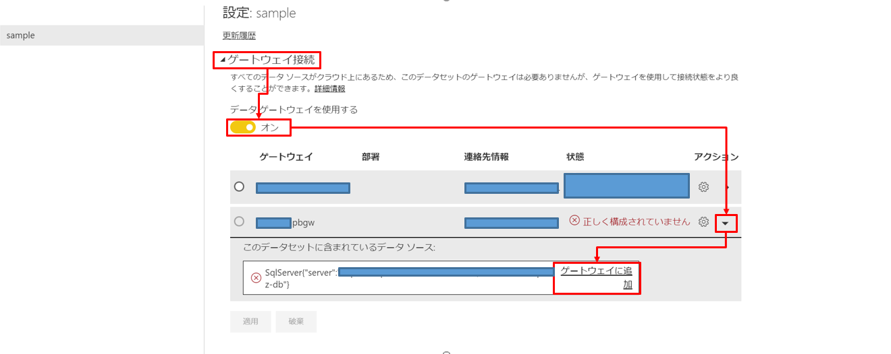

# Power BIの接続確認

- [Power BIの接続確認](#power-biの接続確認)
  - [概要](#概要)
    - [Power BI 接続確認の手順概要](#power-bi-接続確認の手順概要)
    - [1. OnPremise Data Gatewayのインストール](#1-onpremise-data-gatewayのインストール)
    - [2. Power BI Desktopにのデータソース設定](#2-power-bi-desktopにのデータソース設定)
      - [パラメータ設定値確認方法](#パラメータ設定値確認方法)
    - [3. Power BI Serviceへの発行とデータソースの更新設定](#3-power-bi-serviceへの発行とデータソースの更新設定)
  - [次のステップ](#次のステップ)

## 概要

Power BIとデータソースの接続確認を行います。

### Power BI 接続確認の手順概要

1. OnPremise Data Gatewayのインストール
2. Power BI Desktopにのデータソース設定
3. Power BI Serviceへの発行とデータソースの更新設定

---

### 1. OnPremise Data Gatewayのインストール

末尾が、**-pbgw-vm** となっている、仮想マシンのリソースに移動し、RDP接続します。

>**注意**  
複数のGlobal IPを許可する必要がある場合、Network Security Groupの設定を変更してください。

ログイン後、サーバーマネージャーが立ち上がるので、「Local Server」→ 「IDE Enhanced Security Configuration」をクリックします。

管理者の操作では無効にチェックし、「OK」をクリックします。

[標準ゲートウェイをダウンロードおよびインストールする](https://docs.microsoft.com/ja-jp/data-integration/gateway/service-gateway-install#download-and-install-a-standard-gateway)に従って、On Premise Data Gatewayをインストールします。

---

### 2. Power BI Desktopにのデータソース設定

sourceフォルダ内の、Power BIテンプレートファイル「xxx.pbit」を開くと、パラメータの入力画面が表示されます。  
Azure Portalにて、それぞれの値を確認して、入力することで、DBとの接続が検証されデータがPower BI Desktopにロードされます。

#### パラメータ設定値確認方法

Azure Portal上で末尾が **-dw** となっている、Azure Synaps Analyticsリソースに移動します。  
概要画面にて、それぞれの値を確認します。

---

### 3. Power BI Serviceへの発行とデータソースの更新設定

データソースとの接続が完了したら、「発行」をクリックして、任意のワークスペースにPower BIのデータセット、レポートを発行します。

発行先のPower BI Serviceに移動して、「データセット」から、対象のデータセットの設定へ移動します。

「ゲートウェイ接続」→「データゲートウェイを使用する」→「▼」→「ゲートウェイに追加」の順にクリックします。

各種の値を設定後、「追加」をクリックして、データソースの追加を行います。

|項目 |設定値  |備考  |
|---------|---------|---------|
|データソース名     | 任意        | 例：データベース名と同一        |
|データソースの種類     | SQL Server        | 既定        |
|サーバー    | 任意        | 既定        |
|データベース     |         | 既定        |
|認証     | 基本        | AD認証を利用する場合はOAuthを選択        |
|ユーザー名    | 任意       |         |
|パスワード    | 任意        |         |

マップ先を先ほど追加したデータソースに設定し、「適用」をクリックします。

## 次のステップ

[データ投入確認](../10_Artifacts/README.md)
