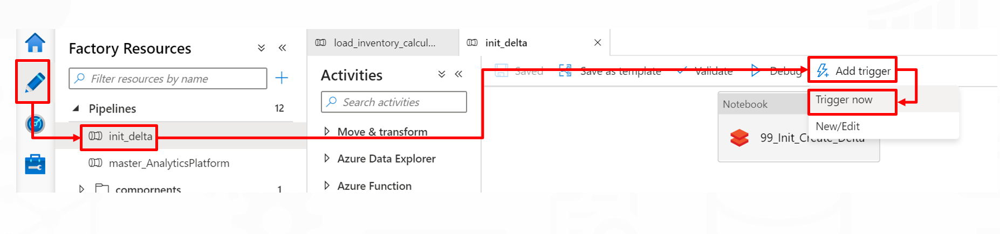
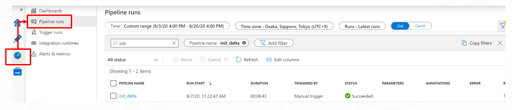
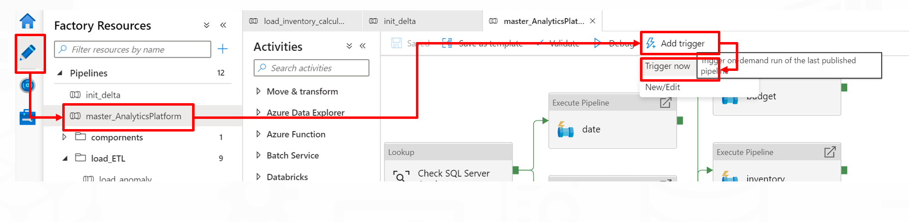
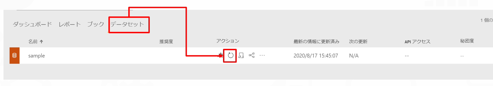

# データ投入確認

- [データ投入確認](#データ投入確認)
  - [概要](#概要)
  - [初期セットアップパイプラインの実行](#初期セットアップパイプラインの実行)
    - [初期セットアップパイプラインの実行手順概要](#初期セットアップパイプラインの実行手順概要)
    - [1. Data Factory　初期パイプラインの実行](#1-data-factory初期パイプラインの実行)
  - [データの投入](#データの投入)
  - [データの投入手順概要](#データの投入手順概要)
  - [リソースのクリーンアップ](#リソースのクリーンアップ)

## 概要

実際にデータを投入し、結果を確認します。

## 初期セットアップパイプラインの実行

初期セットアップパイプラインは以下の処理を実行します。

- データレイクへのデータのインポート
  - [Contoso社 小売データの読み込み](https://github.com/microsoft/sql-server-samples/tree/master/samples/databases/contoso-data-warehouse)で利用されているデータを使用しています。
- Databricks上のDeltaテーブルをセットアップします。

### 初期セットアップパイプラインの実行手順概要

1. Data Factory　初期パイプラインの実行

---

### 1. Data Factory　初期パイプラインの実行

Data Factory開発画面に移動して、「init_delta」パイプラインを選択し、「Add trigger」→「Trigger now」を選択して、パイプラインを実行します。

実行状況はMonitorハブで確認可能です。

正常終了後、Databricks上でテーブルが作成されたことが確認できます。

## データの投入

データ取り込みパイプラインを実行します。

## データの投入手順概要

1. データ取り込みパイプラインの実行

Data Factory開発画面に移動し、「master_xxx」パイプラインを選択し、「Add trigger」→「Trigger now」を選択して、パイプラインを実行します。

正常終了後、Power BI のデータセットを更新します。

データセットの更新後、レポートにデータが反映されます。

## リソースのクリーンアップ

課金が発生するため、作成したリソースを削除します。
保持したい場合は、以下のリソースを停止することで、抑えることが可能です。
- Synapse Analytics
- 仮想マシン *2台