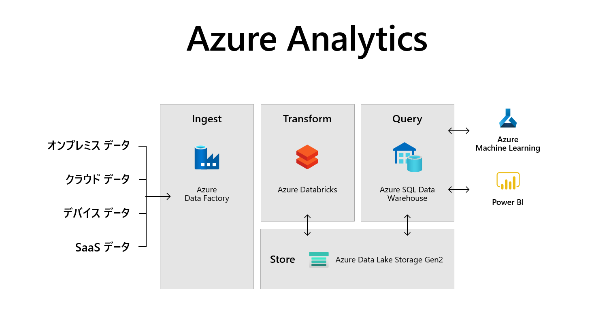

# Azure DevOpsによる環境作成～パイプライン実行

## 概要

Azure DevOpsを利用したAzureデータ基盤の構築ハンズオンラボです。

## 前提条件
 - Azure Subscription
 - リソースグループの所有者権限

## 手順リンク

1. [DevOpsによる環境構築](00_Environment/README.md)
2. [データベースプロジェクトのデプロイ](01_SQL/README.md)
3. [Azure Data Factory 成果物のデプロイ](02_ADF/README.md)
4. [Power BIの接続確認](03_PBI/README.md)
5. [データ投入確認](10_Execute/README.md)
